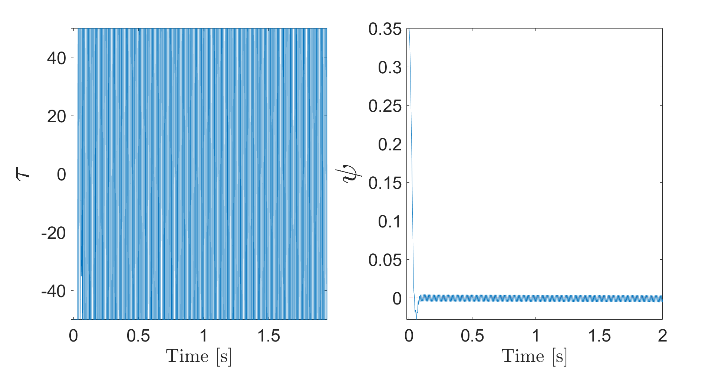
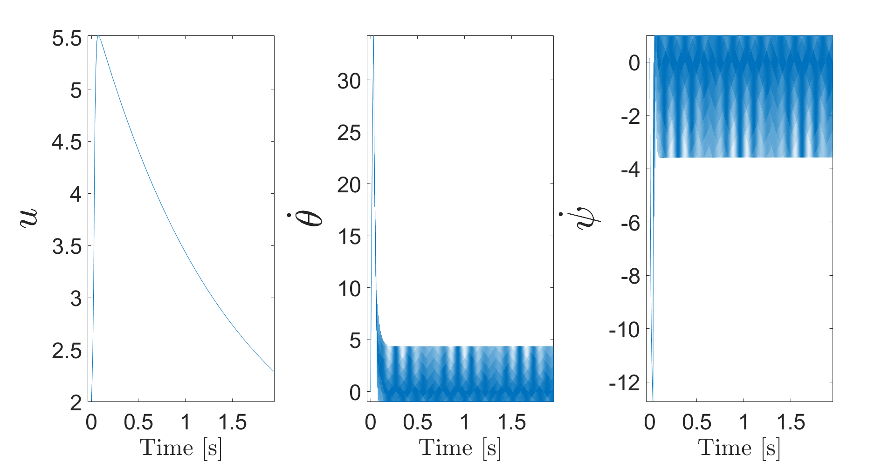
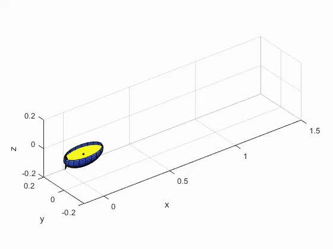
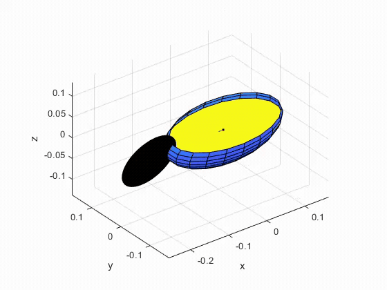

# Stabilization of an Inverted Pendulum on a Nonholonomic System

MATLAB implementation of data-driven Koopman modeling and model predictive control (MPC) for stabilizing the roll of a modified Chaplygin sleigh. The sleigh is underactuated: an internal reaction wheel applies torque in yaw, and that same torque must propel the vehicle and keep its elevated center of mass upright.

Fish-like robots can achieve efficient, agile underwater motion, but slender body shapes may be unstable in roll. The modified Chaplygin sleigh provides a simple nonholonomic model for studying how internal actuation can generate propulsion while simultaneously stabilizing this roll motion.

This repository accompanies:

> K. Loya and P. Tallapragada, “Stabilization of an Inverted Pendulum on a Nonholonomic System,” *IFAC-PapersOnLine*, vol. 55, no. 37, pp. 764–769, 2022. [doi:10.1016/j.ifacol.2022.11.274](https://doi.org/10.1016/j.ifacol.2022.11.274)

## Method at a glance

The vehicle configuration is $q=(x_c,y_c,\theta,\psi)$, where $\theta$ is yaw and $\psi$ is roll. A knife edge at distance $b$ from the center imposes the nonholonomic constraint

$$
v-b\dot{\theta}=0.
$$

This reduces the dynamics to the four-state model

$$
\xi=[u,\dot{\theta},\psi,\dot{\psi}]^\mathsf{T},
$$

where $u$ is longitudinal speed. The nonlinear continuous-time equations are numerically integrated with a fixed-step fourth-order Runge–Kutta scheme to collect snapshot data. Monomials of the reduced states are then used as observables, and a finite-dimensional controlled Koopman predictor is identified by least squares:

$$
z_{k+1}=A z_k+B\tau_k, \qquad \xi_k\approx C z_k, \qquad z_k=\Psi(\xi_k).
$$

The lifted model turns the stabilization problem into a constrained quadratic program. At each MPC update, the controller penalizes roll-angle error and control effort, enforces the lifted linear dynamics, bounds reaction-wheel torque, applies the first control move to the nonlinear plant, and repeats.

<!-- ## Simulation results

The following stored simulation shows the bounded control torque and convergence of the roll angle $\psi$ toward the upright reference:



The corresponding longitudinal velocity, yaw rate, and roll-rate histories are shown below:

 -->

### Animation videos

The GIF previews play directly on GitHub. Select an animation to open its original, higher-quality MP4 file.

| 3D simulation | 3D simulation, run 01 |
| --- | --- |
| [](misc/BoxMovie.mp4) | [](misc/BoxMovie01.mp4) |
<!-- | **3D simulation, run 1** | **3D simulation, run 2** | -->
<!-- | [](misc/BoxMovie1.mp4) | [](misc/BoxMovie2.mp4) | -->

<!-- Additional stored plots for a second simulation case are available as [control and roll response](misc/01_1.png) and [state response](misc/01_2.png). -->

<!-- ## Repository layout

| Path | Purpose |
| --- | --- |
| `codes/No theta/Koopman_CS_roll_randn-Dell-Kloya.m` | Main reduced-state training script: RK4 data generation, quartic monomial lifting, and least-squares identification of $A$, $B$, and $C$. |
| `codes/No theta/Sparsed_MPC.m` | Reduced-state Koopman MPC using `quadprog`; this is the closest executable implementation of the paper's stabilization experiment. |
| `codes/No theta/SMPC_test.m` and `Sparsed_MPC_latest.m` | Alternative MPC weights, horizons, initial conditions, and ODE45 checks. |
| `codes/No theta/Koopman_roll_CS_simulation_not*.m` | Open-loop Koopman predictor validation against the nonlinear model. |
| `codes/No theta/eom_grnd_roll_CS_red.m` | Four-state nonlinear equations of motion for $[u,\dot\theta,\psi,\dot\psi]$. |
| `codes/Koopman_roll_CS.m` | Earlier five-state training workflow that retains yaw angle $\theta$ and uses cubic monomials. |
| `codes/Koopman_roll_CS_cossine.m` | Five-state variant augmented with $\cos\psi$ and $\sin\psi$. |
| `codes/Koopman_roll_CS_simulation*.m` | Predictor validation for the five-state models. |
| `codes/Sparsed_MPC.m` | Earlier five-state Koopman MPC implementation. |
| `codes/eom_grnd_roll_CS*.m` | Full nonlinear dynamics with direct, sinusoidal, or periodic torque inputs. |
| `codes/roll_CS_ground.mlx` | Symbolic derivation of the constraints, Lagrangian, reduced equations, and generated MATLAB dynamics. |
| `codes/No theta/NLMPC for paper/` | Nonlinear MPC comparison using MATLAB's `nlmpc` interface. |
| `codes/Gpops_roll_stabilize.m` | Direct optimal-control experiment using the separately licensed GPOPS-II package. |
| `Results/` | Paper-style predictor and stabilization plots (`.pdf`/`.eps`) plus the scripts used to generate them, stored as `.txt`. |
| `misc/` | Animation, geometry-drawing, derivation, and exploratory files; not required for Koopman MPC. |

The bundled `monomials.m` and `sprepmat.m` utilities originate from SOSTOOLS and are used to construct the polynomial dictionary. -->

## Requirements

- MATLAB with:
  - Symbolic Math Toolbox (`syms`, `subs`);
  - Optimization Toolbox (`quadprog`);
  - Statistics and Machine Learning Toolbox for training scripts that call `normrnd`;
  - Parallel Computing Toolbox for the `parfor`-based large training runs.
- Model Predictive Control Toolbox only for `codes/No theta/NLMPC for paper/NLMPC_CSroll.m`.
- GPOPS-II and its solver dependencies only for `codes/Gpops_roll_stabilize.m`. Edit that script's machine-specific `addpath` before use.

The code is a MATLAB research snapshot rather than a packaged application. Scripts use their current directory for dependencies and output, so run them from the directory in which they are stored.

## Quick start

### 1. Generate the reduced Koopman model

From MATLAB:

```matlab
cd('codes/No theta')
rng(1)  % optional, for repeatable random training data
run('Koopman_CS_roll_randn.m')
```

<!-- This creates `koopman_roll_CS_not_randn12.mat`, containing the learned predictor and the variables needed by the downstream scripts. The default large run uses 200 trajectories, 1000 time steps per trajectory, a sample time of 0.001 s, torque samples in $[-75,75]$ N·m, and all monomials through degree four. It is computationally and memory intensive.

For a very small pipeline check, `Koopman_CS_roll_randn.m` writes the same filename but currently uses only 2 trajectories of 10 samples. That model is useful for debugging the workflow, not for reproducing the reported control quality. -->

> **Important:** `*.mat` is ignored by Git. A fresh clone does not contain the trained models even if they are present in a researcher's local working tree; run a training script before predictor or MPC scripts that call `load(...)`.

### 2. Validate the predictor

```matlab
cd('codes/No theta')
run('Koopman_roll_CS_simulation_not.m')
```

The script compares the lifted linear prediction with the nonlinear RK4/ODE45 response. Its checked-in defaults set both input amplitudes to zero; edit `A1`, `A2`, `W1`, and `W2` near the top to test a periodic input. The paper's corresponding comparison uses

$$
\tau(t)=20\sin(30t)+25\cos(20t).
$$

The pre-generated paper-style predictor plots are in `Results/prediction_1.pdf`, `Results/prediction_2.pdf`, and `Results/prediction_3.pdf`.

### 3. Run Koopman MPC

```matlab
cd('codes/No theta')
run('Sparsed_MPC.m')
```

`Sparsed_MPC.m` loads the reduced Koopman model, constructs the lifted finite-horizon quadratic program, constrains the total torque, propagates the nonlinear plant, and plots torque, longitudinal velocity, yaw rate, roll, and roll rate.

The main parameters are near the top of the script:

| Variable | Meaning | Current value |
| --- | --- | --- |
| `dt` | model sample time, loaded from the trained model | 0.001 s |
| `tsim` | closed-loop simulation duration | 2 s |
| `tpred` | prediction horizon duration | 0.1 s |
| `tcont` | control/update horizon duration | 0.001 s |
| `x0` | $[u,\dot\theta,\psi,\dot\psi]^T$ | $[0.2,0,0.1,0.15]^T$ |
| `maxA` | total torque magnitude limit | 50 N·m |
| `ql(4)` | roll-angle lifted-state weight | 10 |
| `R` | control-effort weight | $10^{-7}$ |

The published experiment used $[u,\dot\theta,\psi,\dot\psi]=[2,0,0.35,0.15]$, a $\pm50$ N·m torque limit, roll weight $q_\psi=10$, and input weight $R=10^{-7}$. Set `x0` accordingly when comparing directly with the paper.|

## Model parameters and conventions

The paper reports $m=2.5$ kg, $h=0.05$ m, $b=0.15$ m, and damping coefficients $[C_u,C_\theta,C_\psi]=[0.85,0.85,0.9]$. The five-state scripts use these values. Several later reduced-state training scripts instead set `M = 1.25` and `C_w = 0.25`; check and align the constants in the selected training and validation scripts before claiming a strict numerical reproduction.

Angles are in radians, angular rates in rad/s, longitudinal velocity in m/s, time in seconds, and control torque in N·m. In filenames and comments, “No theta” means that the yaw angle $\theta$ is omitted from the learned state because the reduced dynamics are invariant to planar position and yaw. The yaw rate $\dot\theta$ remains a state.

## Citation

If this repository or its method is useful in your work, please cite:

```bibtex
@article{loya2022stabilization,
  title   = {Stabilization of an Inverted Pendulum on a Nonholonomic System},
  author  = {Loya, Kartik and Tallapragada, Phanindra},
  journal = {IFAC-PapersOnLine},
  volume  = {55},
  number  = {37},
  pages   = {764--769},
  year    = {2022},
  doi     = {10.1016/j.ifacol.2022.11.274}
}
```

## License

The repository is distributed under the [Apache License 2.0](LICENSE). The bundled SOSTOOLS utility files contain their own GPL notices; consult those file headers when redistributing them.
